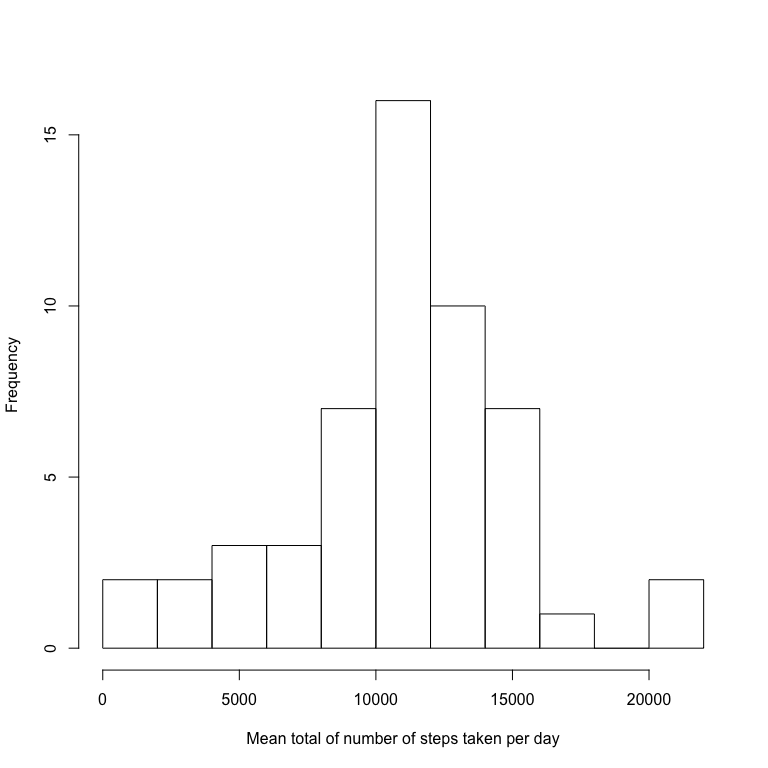
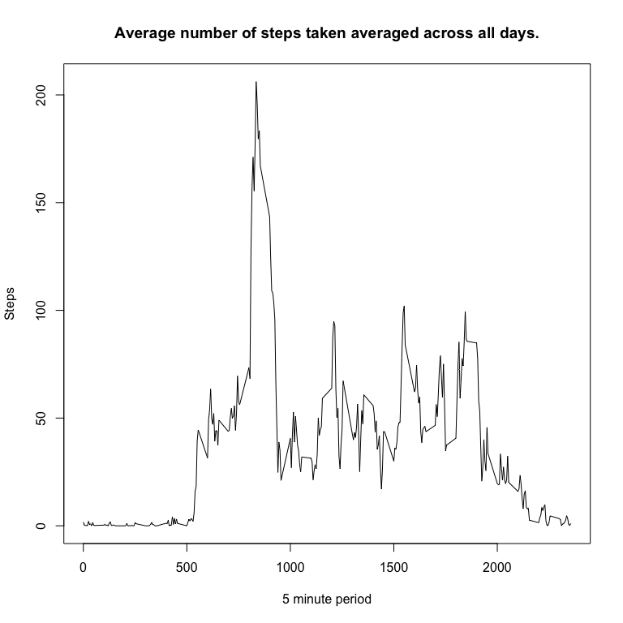
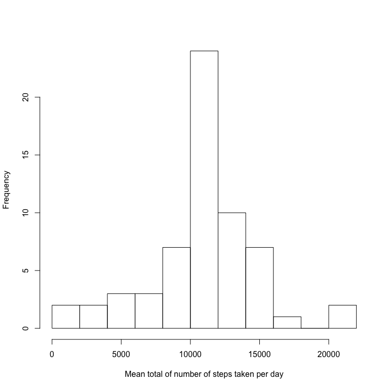
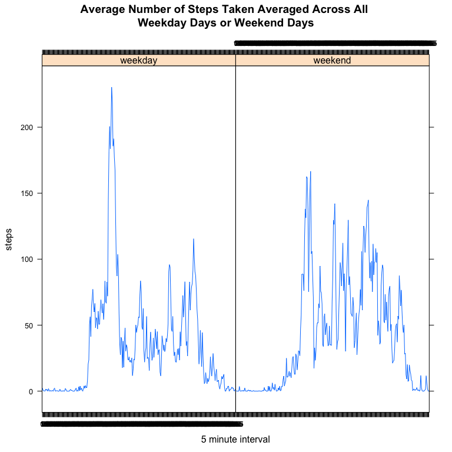

# Reproducible Research: Peer Assessment 1


## Loading and preprocessing the data

I'm creating a directory data and download the provided data there. Unzip the zip file and read the data in. 


```r
if(sum(!(dir() %in% "data")) < 1){
        dir.create("data")}

download.file("https://d396qusza40orc.cloudfront.net/repdata%2Fdata%2Factivity.zip", destfile = "data/Factivity.zip")

unzip("data/Factivity.zip", exdir = "data")

data <- read.csv("data/activity.csv")
```

Converting date from factor to a date format.


```r
data$date <- as.Date(data$date)
```


## What is mean total number of steps taken per day?

Histogram of the total number of steps taken each day


```r
data.mean <- rowsum(data$steps,data$date)
hist(data.mean,xlab = "Mean total of number of steps taken per day",main = "", breaks = 15)
```

<!-- -->
Mean and median number of steps taken each day

Mean value 

```r
mean(data.mean,na.rm = TRUE)
```

```
## [1] 10766.19
```
Median value 

```r
median(data.mean, na.rm = TRUE)
```

```
## [1] 10765
```
## What is the average daily activity pattern?

Time series plot of the average number of steps taken


```r
library(plyr)
data.interval <- ddply(data,~interval, summarise, mean=mean(steps, na.rm = TRUE))

plot(data.interval$interval,data.interval$mean,type = "l", ylab = "Steps", xlab = "5 minute period", main ="Average number of steps taken averaged across all days.")
```

<!-- -->
The 5-minute interval that, on average, contains the maximum number of steps

```r
data.interval$interval[which.max(data.interval$mean)]
```

```
## [1] 835
```
## Imputing missing values

Calculate and report the total number of missing values in the dataset (i.e. the total number of rows with 𝙽𝙰s)


```r
sum(is.na(data))
```

```
## [1] 2304
```
Create a new dataset that is equal to the original dataset but with the missing data filled in.
We are going to use the means of the intervals to fill in the data. 


```r
data.filled <- data
index.na <- is.na(data.filled$steps)
# Create a factor variable out of the interval numeric value. 
data.filled$interval <- factor(data.filled$interval)

data.filled[index.na,"steps"] <- data.interval[data.filled[index.na,"interval"],"mean"]
```

Make a histogram of the total number of steps taken each day and Calculate and report the mean and median total number of steps taken per day. 

```r
data.filled.mean <- rowsum(data.filled$steps,data.filled$date)
hist(data.filled.mean,xlab = "Mean total of number of steps taken per day",main = "", breaks = 15)
```

<!-- -->

Mean value of steps 

```r
mean(data.filled.mean)     
```

```
## [1] 10766.19
```
Median value of steps 

```r
median(data.filled.mean)
```

```
## [1] 10766.19
```
Do these values differ from the estimates from the first part of the assignment? What is the impact of imputing missing data on the estimates of the total daily number of steps?

The values don't differ that much from the original data. The median value has only changed by +1. 

## Are there differences in activity patterns between weekdays and weekends?

Create a new factor variable in the dataset with two levels – “weekday” and “weekend” indicating whether a given date is a weekday or weekend day.


```r
library(lubridate)
```

```
## 
## Attaching package: 'lubridate'
```

```
## The following object is masked from 'package:plyr':
## 
##     here
```

```
## The following object is masked from 'package:base':
## 
##     date
```

```r
data.filled$weekday.type <- ifelse(wday(data.filled$date) == 7 | wday(data.filled$date) == 1, "weekend", "weekday")

data.filled$weekday.type <- factor(data.filled$weekday.type)
```


Make a panel plot containing a time series plot (i.e. 𝚝𝚢𝚙𝚎 = "𝚕") of the 5-minute interval (x-axis) and the average number of steps taken, averaged across all weekday days or weekend days (y-axis). 


```r
library(lattice)

data.filled.interval <- ddply(data.filled, .(interval, weekday.type), summarise,mean = mean(steps))


g <- xyplot(mean ~ interval | weekday.type, data=data.filled.interval,type = "l",ylab = "steps", xlab = "5 minute interval", main = "Average Number of Steps Taken Averaged Across All \nWeekday Days or Weekend Days")

print(g)
```

<!-- -->


Yes there are differences in weekday patterns between workdays and weekdays, the plot indicates that a person moves around more on weekdays than on weekends. 
